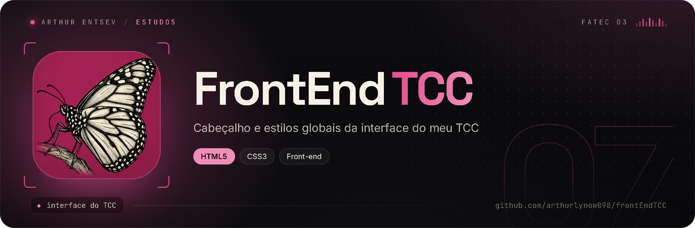
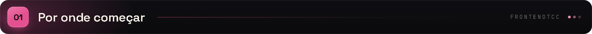
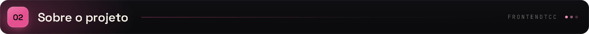
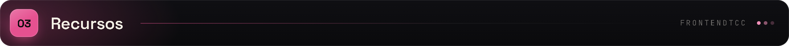
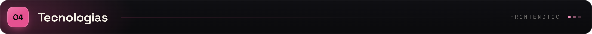
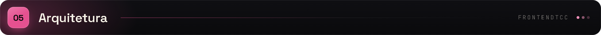
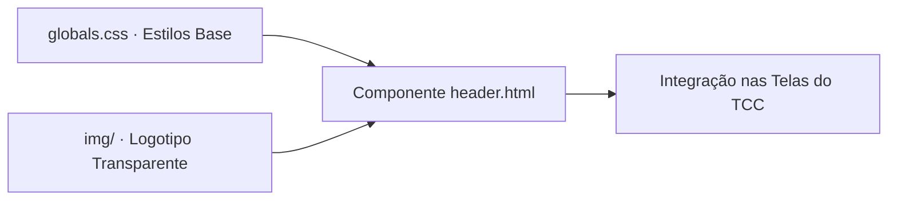
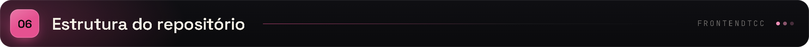
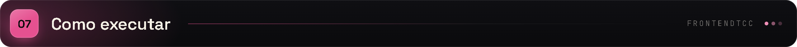
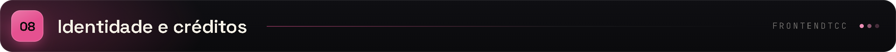

<a id="top"></a>

<p align="center"></p>

<p align="center">Interface web desenvolvida para o trabalho de conclusão de curso.</p>

<p align="center">


</p>


<p align="center"><a href="#visão-geral">Visão geral</a> &nbsp;·&nbsp; <a href="#recursos">Recursos</a> &nbsp;·&nbsp; <a href="#como-executar">Como executar</a></p>


<a id="explore-o-projeto"></a>

<a id="por-onde-começar"></a>

<p></p>


- **[Página](header.html)**, marcação HTML da interface.
- **[Estilos](globals.css)**, estilos compartilhados da página.
- **[Imagens](img)**, recursos visuais usados no front-end.


<a id="visão-geral"></a>

<a id="sobre-o-projeto"></a>

<p></p>

Este repositório preserva o componente base de interface (header.html), a folha de estilos global (globals.css) e o logotipo com fundo transparente (img/), estruturados para integração direta às páginas principais do projeto.

<a id="recursos"></a>


<p></p>

**Cabeçalho reutilizável**<br>
header.html estrutura a barra superior com marca e links de navegação prontos para inclusão nas páginas.

**Reset e estilos globais**<br>
globals.css padroniza margens, tipografia, cores e comportamento responsivo dos elementos base.

**Ativo gráfico otimizado**<br>
Logotipo em PNG com fundo transparente na pasta img/ para sobreposição limpa em diferentes temas.

<a id="tecnologias"></a>


<p></p>

- **HTML5 (header.html)** para marcação semântica do componente de topo
- **CSS3 (globals.css)** para regras de layout, flexbox e variáveis visuais.

<a id="arquitetura"></a>

<p></p>



```mermaid
flowchart LR
    A["globals.css · Estilos Base"] --> C["Componente header.html"]
    B["img/ · Logotipo Transparente"] --> C
    C --> D["Integração nas Telas do TCC"]
```


<a id="estrutura-do-repositório"></a>

<p></p>


```text
frontEndTCC/
├── assets/
│   └── identity/banner.png               Banner do projeto
├── img/                            Logotipo e recursos visuais da barra superior
├── globals.css                     Regras globais de estilização e layout
├── header.html                     Estrutura HTML do componente de cabeçalho
└── README.md
```


<a id="como-executar"></a>


<p></p>

1. Clone o repositório
   ```bash
   git clone https://github.com/arthurlynow098/frontEndTCC.git
   ```
2. Abra o arquivo header.html no navegador ou com a extensão *Live Server* do VS Code para inspecionar o componente renderizado junto ao globals.css.


<p align="center">
  <a href="https://github.com/arthurlynow098">GitHub</a> &nbsp;·&nbsp;
  <a href="https://arthurentsev.vercel.app/">Portfólio</a> &nbsp;·&nbsp;
  <a href="https://www.linkedin.com/in/entsevarthur/">LinkedIn</a>
</p>


<a id="identidade-e-créditos"></a>

<p></p>

<table><tr><td width="150"></td><td><strong>Borboleta</strong><br>Transformação e expressão visual.<br><br><a href="assets/identity-v2/logo.png">Logo em PNG</a> · <a href="assets/banner.png">Banner em PNG</a></td></tr></table>

Artes da coleção fornecida por **Arthur Entsev**, com adaptação das logos e acabamento dos banners realizados com auxílio de geração de imagens. Referências de identidade e apresentação, [LynowCut](https://github.com/arthurlynow098/LynowCut), [LynowMic](https://github.com/arthurlynow098/LynowMic) e [LynowCatch](https://github.com/arthurlynow098/LynowCatch). Os créditos e avisos do conteúdo original foram preservados.

<p align="center"><a href="#top">Voltar ao topo ↑</a> · <a href="https://github.com/arthurlynow098">Arthur Entsev</a> · <a href="https://arthurentsev.vercel.app/">Portfólio</a></p>
